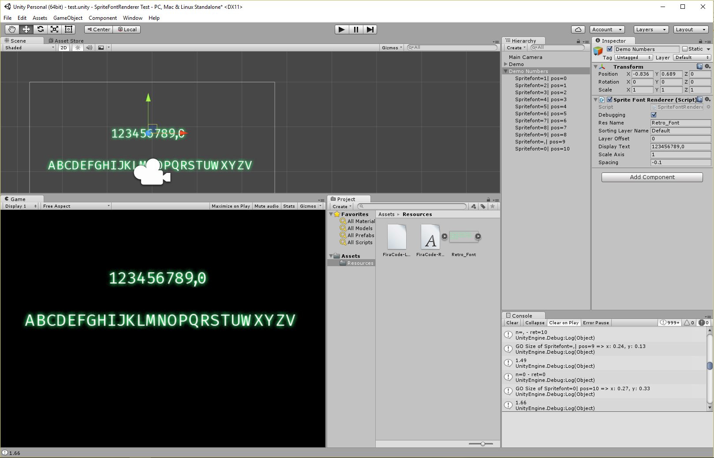

# Unity-SpriteFontRenderer
## Usage
1. Import a Picture containing the text, set the sprite mode to multiple
2. Slice it - set the pivot per default at the bottom left position
3. For every letter that has a descender - e.g. y,g,... set the pivot to custom and adjust the y position to match the other letter's heights.
4. Either create a game object via the editor or on a script, set up the public fields such as:
	- resName: Name of the Picture ressource, has to be in /resources/ to load up
	- displayText: Text to be displayed can contain 0-9, A-Z, a-z
	- scaleAxis: to scale the Spriterenderer (might be not needed if you scale the parent gameobject that 		contains the script).
Simple Script to render Spritefonts

## Features
+ Live preview in editor mode that allows quick previews when finetuning the scliced images in the sprite editor
+ Displays A-Z, a-z and 0-9 plus ,
+ Easy to adapt

Example:

